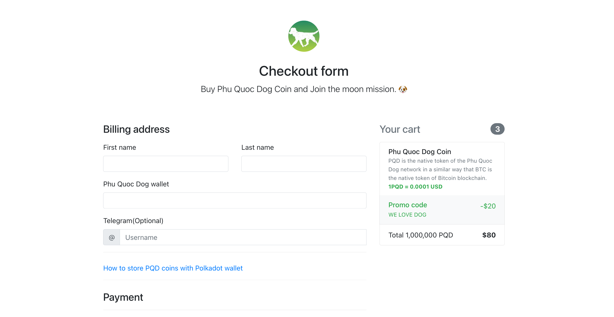

# Phu Quoc Dog Campaign  👋

[](https://docs.phuquoc.dog)
[](LICENSE)

> Phu Quoc Dog Campaign is aiming to provide a more convenient to buy PQD coin.

### 🏠 [Homepage](https://phuquoc.dog)

### ✨ [Demo](https://phuquoc.dog)

### Running your React application

First, you will need to install library, the JavaScript bundler that ships with React .

```sh
yarn install
yarn start
```

You should see your new app running in the browser shortly.



## Author

👤 **Phu Quoc Dog Developers**

* Website: https://phuquoc.dog

## 🤝 Contributing

Contributions, issues and feature requests are welcome!

Feel free to check [issues page](https://github.com/phuquocdog/campaign/issues). You can also take a look at the [contributing guide](CODE_OF_CONDUCT.md).

## Show your support

Give a ⭐️ if this project helped you!


## 📝 License

This project is [Apache-2.0](/LICENSE) licensed.
